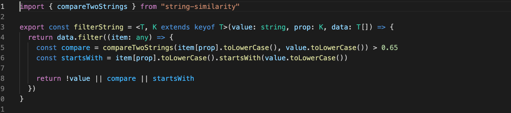
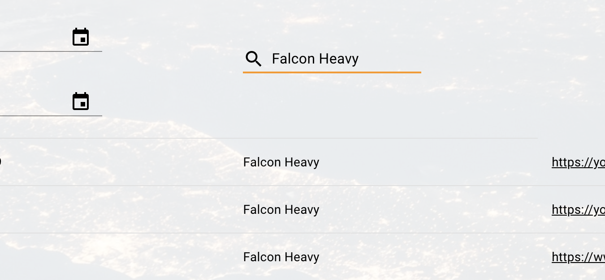
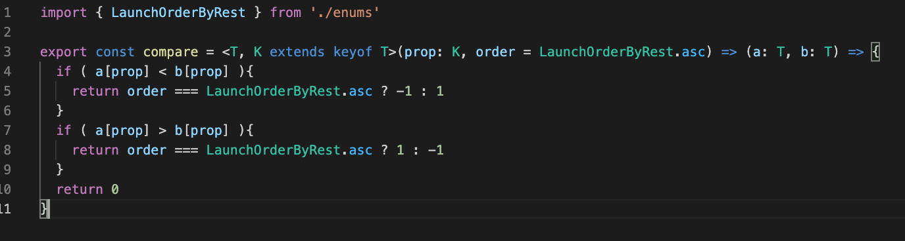
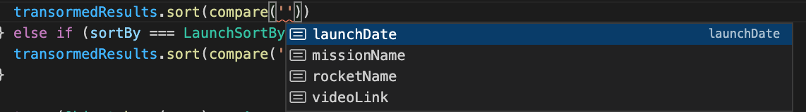

# Spacex GraphQL API
First a few ground rules.
> 📙 **Definition**: This will denote a definition of often used industry lingo

> ℹ️ **Why like this?**: This will denote my explaination for a given implementation

## Run it yourself

> 📙 **GraphQL** is a specification that describes a consistent query and manipulation language for varying data sources.

This is a **GraphQL** server that I've built alongside [Spacex React](https://github.com/SkylarWapato/spacex-react).  Together they demonstrate a simple application with sorting and filtering.

To run the server, run: 

```npm i```

Followed by:

```npm run start```

The console should output

```Server ready at http://localhost:4000/```

Visit [localhost:4000](http://localhost:4000) to query the API directly or clone [Spacex React](https://github.com/SkylarWapato/spacex-react) to run the client-side application along-side this project.

## The lay of the land

> 📙 **Typescript** is a superset of Javascript that provides type safety to the dynamic language.

The project is written in **Typescript** and configured to load **GraphQL** files.  Once loaded, we honor the schema.graphql with resolvers written in **Typescript**.

The API consists of a single query that enables sorting and filtering on 3 fields: Mission name, Rocket name, and Launch year.  Sorting arguments for "Mission name" and "Launch year" are parsed to url parameters and passed to the Spacex API.  Rocket name is sorted via business logic as it is a nested property in its source API.

The search arguments for "Mission name" and "Rocket name" are managed by a string similarity function that matches both on the "startsWith" function and a string similarity tool.

> ℹ️ **Why like this?**: Spacex data is relatively small, so we can extend our feature set without incurring too much performance or data transfer costs.  If I had more time, I would load the data into elastisearch to open up extremely powerful search features

"Launch date" is a unix timestamp.  Users can elect to filter before, after, or between dates.

## Points of note

### String similarity (src/libs/filter.ts)


Implementing search in this manner benefits our users by being more forgiving.  For example, in the following images you'll see a user searching "Falcon Heavy" and "Falcon Haevy" (this is a common misspelling of heavy), yet both return the same records.



Given a larger data set or heavy production load, I would begin to implement pagination and other measures to ensure the performance of our app.

### Compare function (src/libs/compare.ts)

This functtion is simple and manages the sorting of our "rocket" property.

You'll see by our use of generics, compare infers the only properties you could possibly sort, which enables us quick iteration because we don't need to refer to a separate file


You'll also notice that it throws a compilation error if you select an invalid entry.  Since we used generics, this sort could be used for any array iteration in the application.

# That's it!
Please see [Spacex React](https://github.com/SkylarWapato/spacex-react) for the client-side portion of this project.